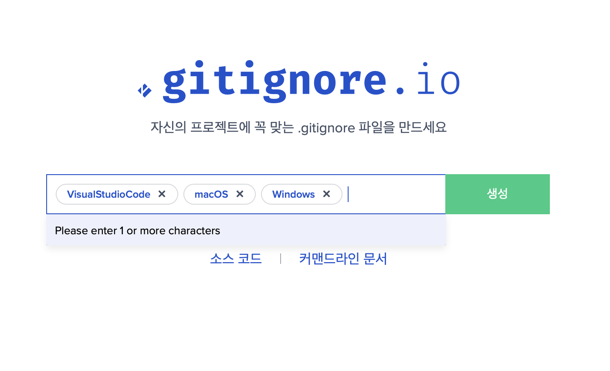

# 팁 : gitignore 자동으로 만들기!

1. [toptal.com/developers/gitignore]: https://www.toptal.com/developers/gitignore 로 들어간다.
2. 자신의 개발환경, 사용하는 프레임워크 등등을 입력한다. ( window mac visualstudiocode )
3. 결과를 복사하여 .gitinore 파일에 붙여넣은다.

